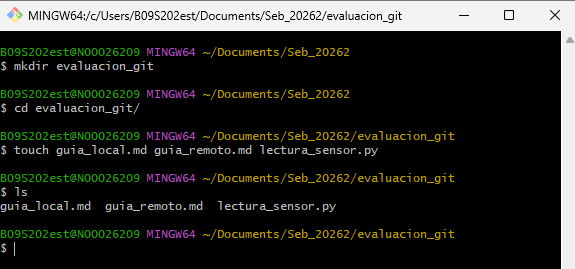
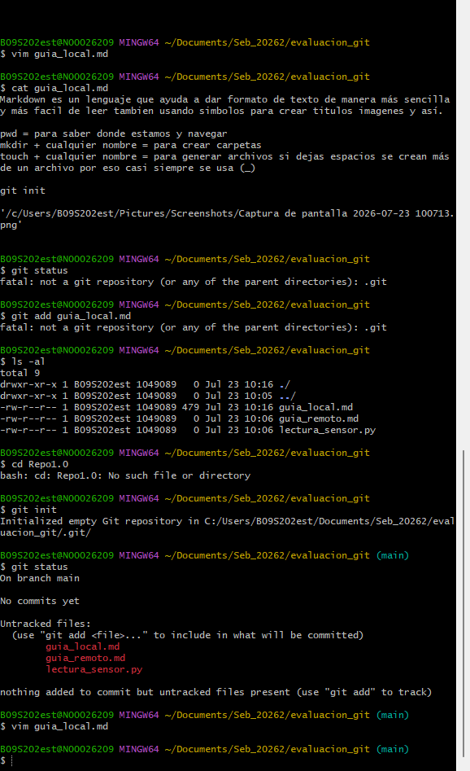

# Markdown primera explicación breve
Markdown es un lenguaje que ayuda a dar formato de texto de manera más sencilla y más facil de leer tambien usando simbolos para crear titulos imagenes y así.

## Los comandos de consola utilizados en la Parte 1 para navegar, crear carpetas y generar archivos.  
pwd = para saber donde estamos y navegar
mkdir + cualquier nombre = para crear carpetas  
touch + cualquier nombre = para generar archivos si dejas espacios se crean más de un archivo por eso casi siempre se usa (_)  

## El comando exacto empleado para inicializar el repositorio local.  
git init

